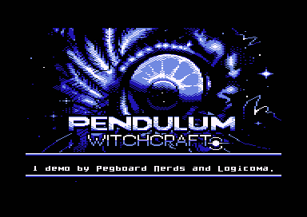

# witchcraft

Source code for Witchcraft by Pegboard Nerds and Logicoma, a 16 kilobyte demo for the Commodore 64

](final/screenshot.png)

## description

This is the source code for our 16 kilobyte demo, Witchcraft, released at Datastorm Summer 2017 for the Commodore 64. It's a small demo built to showcase a cool SID cover of the song Witchcraft by Pendulum. This is the exact repo we worked in - none of it has been edited or modified, except for some additional source images added that were originally on dropbox. As such, there are some quirks to how things are built and some things are kindof messy/broken. I have no intention of fixing this; this is meant to be a snapshot of the exact data we worked with while making the intro, shared publicly because why not.

Enjoy!

## license

This code is licensed under the MIT license (see LICENSE).
